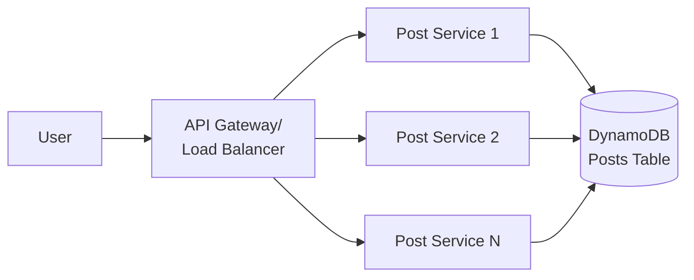
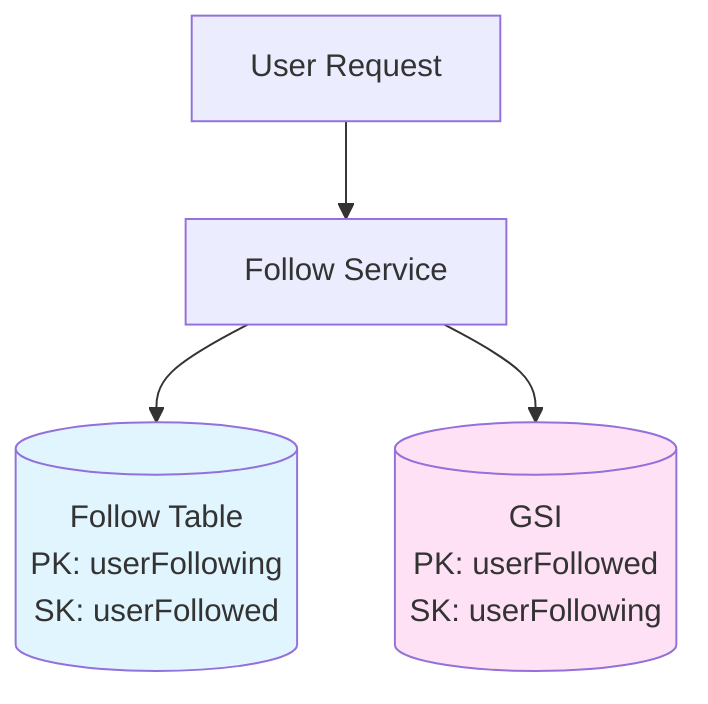
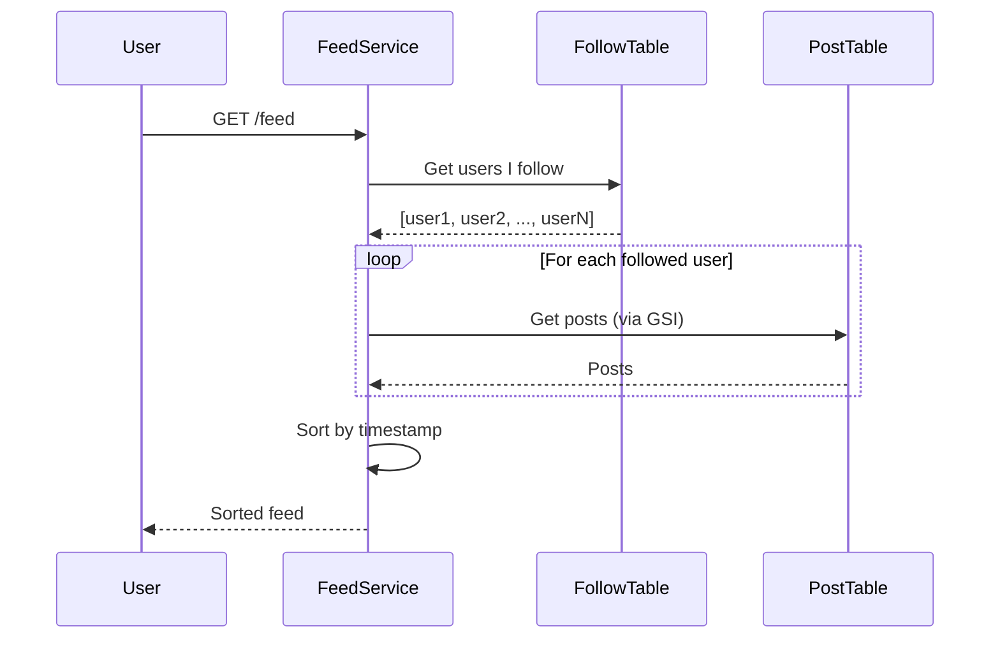
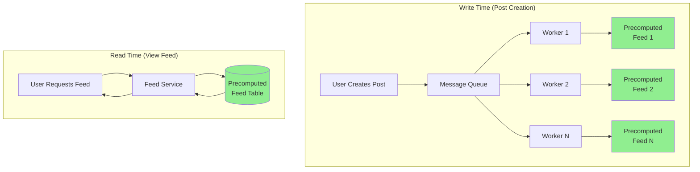
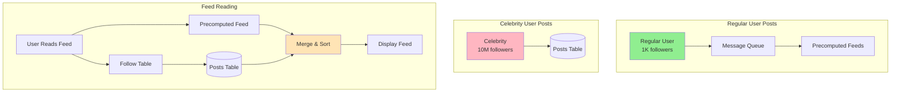
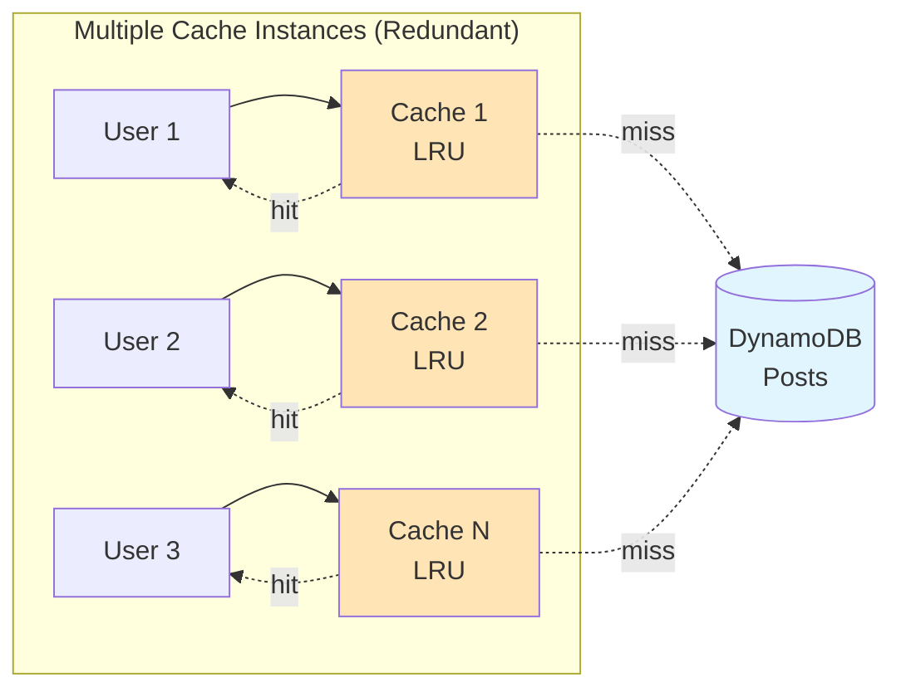

# News Feed System Design

## Problem Overview

Design a social feed system (like Facebook/Twitter) that handles uni-directional follow relationships and displays posts chronologically.

**Core Challenge**: Fan-out problem - handling users who follow many people OR have many followers.

## Requirements

### Functional

- ✅ Create posts
- ✅ Follow/unfollow users
- ✅ View feed (chronological posts from followed users)
- ✅ Paginate through feed
- ❌ Out of scope: Likes, comments, privacy settings

### Non-Functional

- **Availability > Consistency**: Eventual consistency (up to 1 min staleness)
- **Latency**: < 500ms for posting and viewing
- **Scale**: 2B users, unlimited follows/followers

## Core Entities

- **User**: User in the system
- **Follow**: Uni-directional link between users
- **Post**: Content created by users, shown in followers' feeds

## API Design

```http
POST /posts
{ "content": {} }
→ 200 OK { "postId": "..." }

PUT /users/[id]/followers
→ 200 OK (idempotent)

GET /feed?pageSize={size}&cursor={timestamp}
→ { items: Post[], nextCursor: string }
```

**Key Decision**: Use timestamp cursor for pagination (chronological ordering makes this efficient).

## DynamoDB Fundamentals

Before diving into the architecture, let's understand key DynamoDB concepts we'll use:

### Partition Key & Sort Key

**Partition Key (PK)**:

- Primary identifier that determines which physical partition stores the data
- DynamoDB uses hash function on PK to distribute data across partitions
- Must be included in every query
- Example: `userId`, `postId`

**Sort Key (SK)**:

- Optional secondary identifier that determines order within a partition
- Data with same PK is stored together, sorted by SK
- Enables range queries (get all items where PK=X and SK > Y)
- Example: `timestamp`, `followerId`

**Combined Key**: Partition Key + Sort Key = Unique identifier

```text
Example: Follow Table
PK: userFollowing | SK: userFollowed
--------------------|------------------
user123            | user456          ← Alice follows Bob
user123            | user789          ← Alice follows Carol
user456            | user123          ← Bob follows Alice

Query "Who does user123 follow?": PK=user123 → Returns all items (range query)
Query "Does user123 follow user456?": PK=user123, SK=user456 → Returns 1 item (point query)
```

### Global Secondary Index (GSI)

**What**: An alternate view of your table with different partition/sort keys

**Why**: Enables queries on attributes that aren't your primary keys

**How it works**:

- DynamoDB maintains GSI automatically as you write to main table
- GSI has its own partition key and optional sort key
- Allows querying data in different access patterns

**Example**:

```text
Main Table (Follow):           GSI (Followers):
PK: userFollowing              PK: userFollowed
SK: userFollowed               SK: userFollowing

Query main table:              Query GSI:
"Who does Alice follow?" ✓     "Who follows Bob?" ✓
"Who follows Bob?" ✗           "Who does Alice follow?" ✗
```

**Key Benefits**:

- ✅ Multiple access patterns on same data
- ✅ No need for multiple tables
- ✅ Automatically kept in sync
- ⚠️ Eventually consistent (slight delay in updates)
- ⚠️ Additional storage cost (duplicates data)

### Why This Matters for News Feed

1. **Follow Table**: Need to query both "who I follow" AND "who follows me"
   - Main table: Optimized for "who I follow" (PK: userFollowing)
   - GSI: Optimized for "who follows me" (PK: userFollowed)

2. **Post Table**: Need to query by postId AND by creatorId+timestamp
   - Main table: Get specific post (PK: postId)
   - GSI: Get all posts by user, sorted by time (PK: creatorId, SK: timestamp)

3. **Efficient Range Queries**: Sort key enables "get posts created after X timestamp"

## High-Level Architecture

### 1. Post Creation



- API Gateway/Load Balancer → Stateless Post Service → DynamoDB
- Horizontally scalable (add more hosts as needed)
- **Post Table**: Use DynamoDB key-value store
  - Partition key: `postId`
  - GSI: `creatorId` (partition) + `createdAt` (sort) for user post lookups

### 2. Follow Relationships



- **Follow Table** in DynamoDB (models graph relationship)
  - Partition key: `userFollowing`, Sort key: `userFollowed`
  - GSI: Reverse index for follower lookups
- Enables 3 queries:
  - Check if A follows B: Lookup with both keys
  - Get all users A follows: Query by partition key
  - Get all followers of B: Query GSI

**Example:**

If Alice (user123) follows Bob (user456) and Carol (user789):

```text
Follow Table:
| userFollowing | userFollowed |
|---------------|--------------|
| user123       | user456      |  ← Alice follows Bob
| user123       | user789      |  ← Alice follows Carol
| user456       | user789      |  ← Bob follows Carol

GSI (Reverse Index):
| userFollowed  | userFollowing |
|---------------|---------------|
| user456       | user123       |  ← Bob is followed by Alice
| user789       | user123       |  ← Carol is followed by Alice
| user789       | user456       |  ← Carol is followed by Bob
```

**Query Examples:**

- "Does Alice follow Bob?" → Query: `PK=user123, SK=user456` → ✅ Found
- "Who does Alice follow?" → Query: `PK=user123` → Returns: [user456, user789]
- "Who follows Carol?" → Query GSI: `PK=user789` → Returns: [user123, user456]

### 3. Feed Generation (Naive Approach)



**Process:**

1. Query Follow table → Get all users the requestor follows
2. Query Post table (via GSI) → Get posts from those users
3. Sort by timestamp → Return to user

**Problems:**

- ❌ User follows many people → many DB queries (fan-out on read)
- ❌ Many posts per user → large data volume
- ❌ Combined: unacceptable latency

### 4. Pagination

- Use timestamp cursor: "oldest post seen so far"
- Filter posts older than cursor timestamp
- Leverage existing GSI for efficient queries

## Scaling Deep Dives

### Problem 1: User Follows Many People (Read Fan-Out)



#### Solution: Precomputed Feed Table

- **PrecomputedFeed Table**:
  - Key: `userId`
  - Value: Ordered list of ~200 recent postIds
  - Storage: 2KB/user × 2B users = 4TB (reasonable)
- **On Post Creation**: Write postId to all followers' precomputed feeds
- **On Feed Read**: Simply fetch precomputed list (fast!)
- **Tradeoff**: Write fan-out for read performance
- **Product Limit**: Consider max follows (e.g., 5K like Facebook)

### Problem 2: User Has Many Followers (Write Fan-Out)

**Challenge**: Creating one post → write to millions of feeds



#### Solution: Hybrid Approach

- Regular users: Use precomputed feeds (write fan-out)
- Celebrity users: Pull posts on-read (read fan-out, acceptable for celebrities)
- Use eventual consistency window (< 1 min) to distribute writes
- Consider message queue/async processing for feed updates

### Problem 3: Hot Posts (Uneven Read Load)

**Challenge**: Viral posts create "hot keys" in DynamoDB, causing uneven partition load.



**Note**: Each cache can serve the same postId (no sharding). Hot post may hit N caches → N DB requests (vs millions without cache).

#### Solution: Redundant Post Cache

- Multiple cache instances (LRU eviction, long TTL)
- Each cache can serve same postId (no sharding needed)
- N cache instances = N DB requests max (vs millions without cache)
- Tradeoff: Less cache efficiency but better hot key handling

**Alternative**: Distributed Post Cache (shard by postId) - more efficient but harder to manage hot keys.

## Key Learnings

### Architectural Patterns

1. **Read-Heavy Systems**: Precompute on write, cache aggressively
2. **Fan-Out Problem**: Choose between read fan-out vs write fan-out based on access patterns
3. **Product Constraints**: Setting limits (max follows) can simplify architecture
4. **Pagination**: Limit depth (e.g., 200 posts) - most users don't go deep
5. **Hot Keys**: Redundant caching > sharded caching for unpredictable hot spots

### Database Design

- **GSI Strategy**: Design indexes for your query patterns (userFollowing, userFollowed, creatorId+timestamp)
- **DynamoDB Scaling**: Requires even load distribution across partitions
- **Graph Databases**: Only needed for complex traversals (friends-of-friends), overkill for simple relationships

### Interview Strategy

- Start with naive solution, identify scaling issues, then optimize
- Focus on "interesting" problems (fan-out, caching) not trivial details
- Use concrete numbers (2B users, 200 posts, < 500ms) to justify decisions
- Cover breadth first, then dive deep on scaling challenges

### Cost Analysis

- Back-of-envelope: 2KB/user × 2B users = 4TB storage
- Rule of thumb: Cost per user should be tiny fraction of revenue per user

